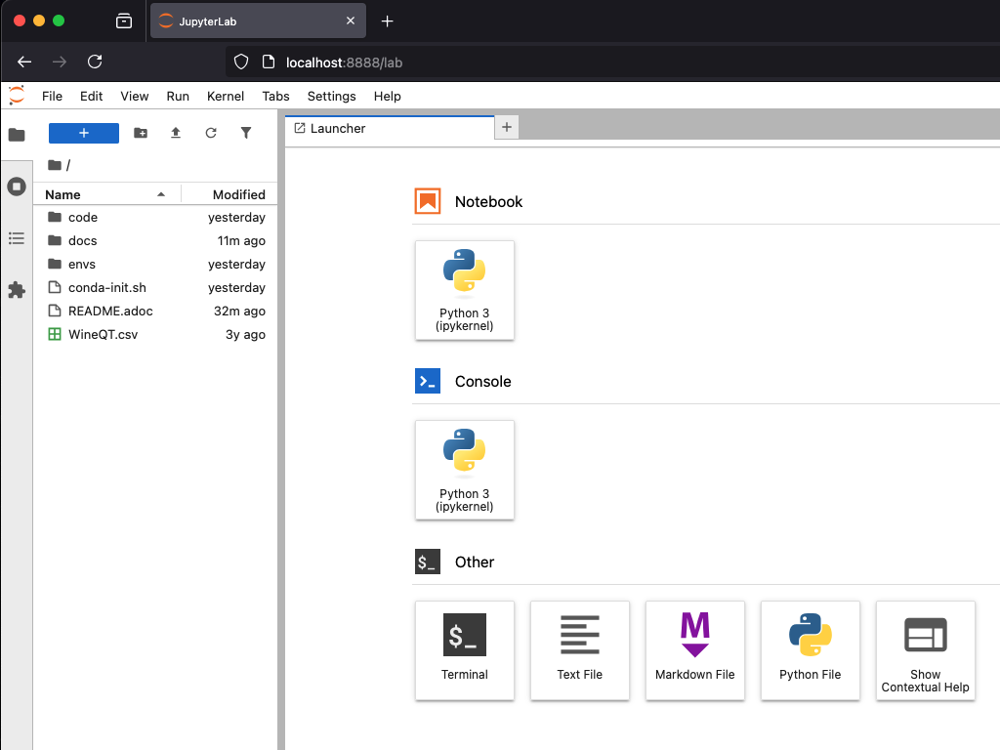

== What is JupyterLab? ==

=== The Challenge ===

Try the `wine-sklearn.py` workflow - have a look at the script and try to convince the second model, which you want to compare to the first one, to work.

The example script for two model types using SciKit-Learn trains the first _SVC_ model, but the second model, _NuSVC_, is deliberately commented out because there is an issue with one of its parameters.

The idea is to set up the sample data first, and then train both models on the same dataset.

It's going to take a lot of re-running of the same code while testing it, commenting out certain chunks, hacking away at others, and ultimately a lot of time wasted for boilerplate stuff. You need to re-run the entire script every time you make a change, which is very awkward and time-consuming. Whenever you change something in the lead-up code, you will need to make sure it still works with both models and so on.

If you try executing the same workflow in an interactive interpreter (just starting `python3` and then typing away), by copying the script to a Python shell line by line, it's even worse. It is extremely inconvenient.

If you just want to return a couple of steps to change something about your data, and then re-run the training of a model, it is not very transparent what the state of your data is at the moment and what the correct order of steps should be.

=== The Solution ===

JupyterLab Notebooks were designed to resolve those problems by being something in between. You can run them as a script, but you can also run individual blocks of a notebook called _cells_ in isolation.

You can conveniently mix documentation markup with the cells to provide guidance as to how to run the cells and what care should be taken when doing so. Think of those as comments on steroids.

It gets better - you can define different Python kernels which belong to various Conda environments, in the same JupyterLab instance, and simply associate your notebooks with the kernel they need, so that they can run in whichever environment you want them to.

If you want to use your environments that way, the best way to do it is to install `jupyterlab` into the base environment.

=== Installing It All ===

[subs="+quotes"]
----
(_whatever_) $ *mamba activate base*

(base) $ *pip install jupyterlab*
Collecting jupyterlab
...
Successfully installed MarkupSafe-3.0.2 ... _omitted_ ... websocket-client-1.8.0
----

Starting Jupyter will automatically open it in your browser.

[subs="+quotes"]
----
(base) $ *jupyter lab*
[I 2025-04-07 14:54:37.059 ServerApp] jupyter_lsp | extension was successfully linked.
...
[I 2025-04-07 14:54:39.694 LabApp] Build is up to date
----

.JupyterLab Web Application

If you want to reopen it at any later point, you can point your browser to `\http://localhost:8888/lab` and it will reload the last state of the workbench before you closed it.

There are a couple of additional options you can use, the two most convenient are listed below.

* `--no-browser`, do not open a browser tab/window
* `--notebook-dir=_path_`, where to load notebooks and kernels from

You can also control Jupyter server with the `jupyter-server` command.

[subs="+quotes"]
----
(base) $ *jupyter-server list*
Currently running servers:
http://localhost:8888/?token=xxxx :: /foo/bar/machine-learning-local

(base) $ *jupyter-server stop*
[JupyterServerStopApp] Shutting down server on 8888...
----

=== Adding Conda Environments to JupyterLab ===

Introduce Jupyter Kernels into each of the conda environments (except `base`, which already has JupyterLab).

[subs="+quotes"]
----
(base) $ *mamba activate sklearn-16*

(sklearn-16) $ *pip install ipykernel*
Collecting ipykernel
...
Successfully installed appnope-0.1.4 ... _omitted_ ... wcwidth-0.2.13
----

Then, while JupyterLab is running, tell the `ipykernel` module to register itself with the default server.

[subs="+quotes"]
----
(sklearn-16) $ *python -mipykernel install --user --name=sklearn-16*
Installed kernelspec sklearn-16 in /foo/bar/baz/Jupyter/kernels/sklearn-16
----

Do the same for the other environments.

As you register additional kernels, you will see them show up in the JupyterLab web application.

Once you open a notebook, you can select the kernel you need to run it with in the top-right corner menu.
